# nitrozen-vue
​
<br>
​
### Nitrozen Badge
​
```
name: 'nitrozen-badge',
props:
    state:
        1. info
        2. success
        3. warn
        4. disable
        5. none,
    fill: Boolean
​
```
​
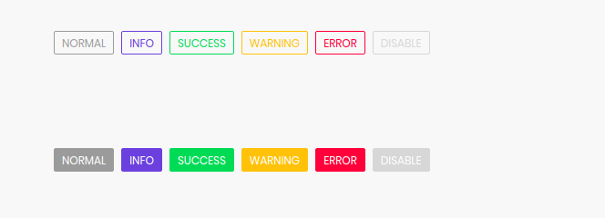<br><br><br><br><hr>
​
​
### Nitrozen Button
​
```
name: 'nitrozen-button',
directives:
    1. strokeBtn
    2. flatBtn
props:
    href: String
    type: String
    disabled: Boolean
    rounded: Boolean
    theme: 'primary' or 'secondary'
    size: 'small' or 'medium' or 'large'
    focused: Boolean
    showProgress: Boolean
​
```
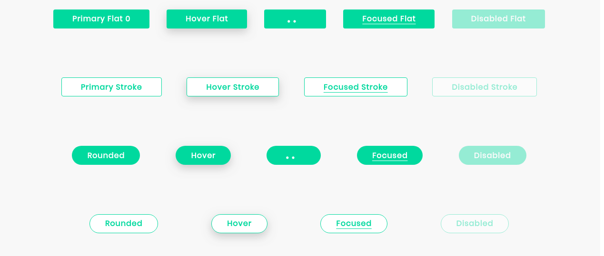<br>
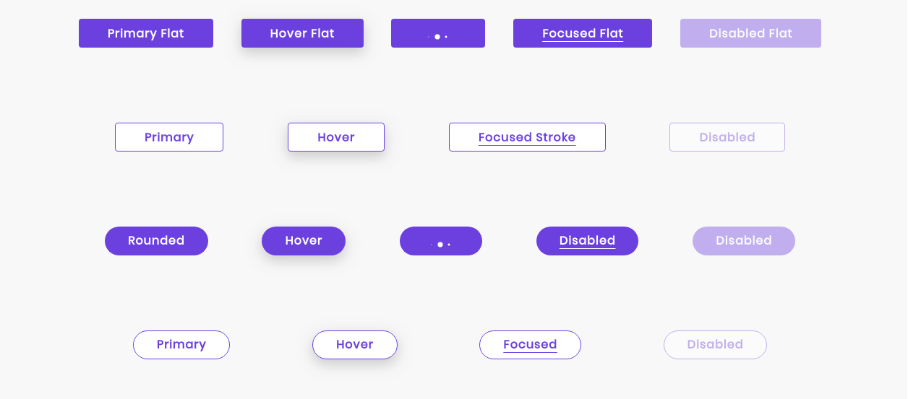<br>
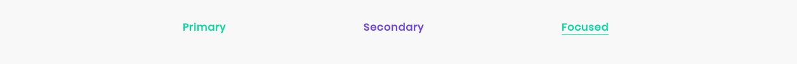<br><br><br><br><hr>
​
### Nitrozen Chips
​
```
name: 'nitrozen-chips',
props:
    disable: Boolean
    theme: 'primary' or 'secondary'
    inProgress: Boolean
    error: Boolean
    multiSelect: Boolean
    state:
        1. error
        2. success
        3. progress
        4. selected
​
```
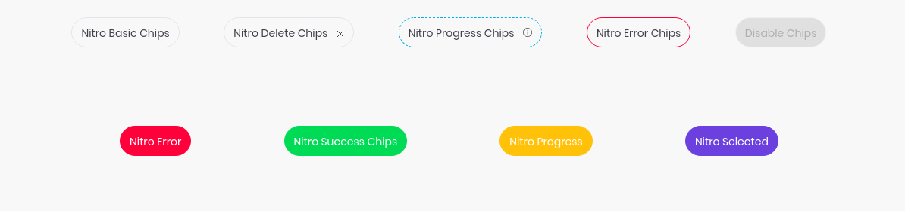<br><br><br><br><hr>
​
### Nitrozen Dialog
​
```
name: 'nitrozen-dialog',
props:
    id: String
    title: String
methods:
    open(config?: DialogConfig): NitrozenDialog
    close()
    isOpen(): Boolean
​
DialogConfig:{
      data: null,
      dismissible: true,
      isModalVisible: false,
      negativeButtonLabel: false,
      neutralButtonLabel: "Ok",
      positiveButtonLabel: false
      showcloseButton: false,
}
​
```
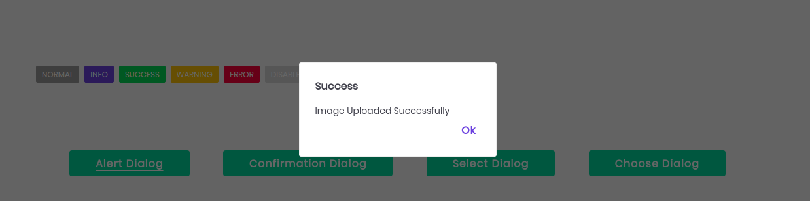<br>
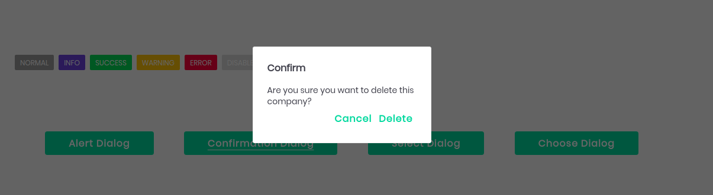<br><br><br><br><hr>
​
### Nitrozen Dropdown
​
```
name: 'nitrozen-dropdown',
props:
    items: Array
    disabled: Boolean
    label: String
    required: Boolean
    value: v-model
​
```
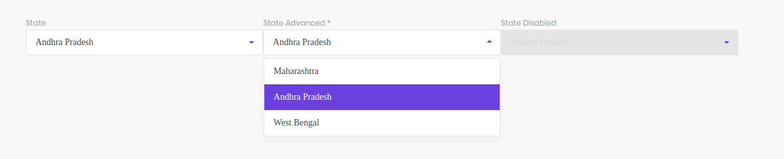<br><br><br><br><hr>
​
### Nitrozen Input
​
```
name: 'nitrozen-input',
props:
    type:
        1. text
        2. textarea
    label: String
    placeholder: String
    disabled: Boolean
    value: v-model
    search: Boolean
    showSearchIcon: Boolean
    showTooltip: Boolean
    tooltipText: String
    maxlength: Number
​
```
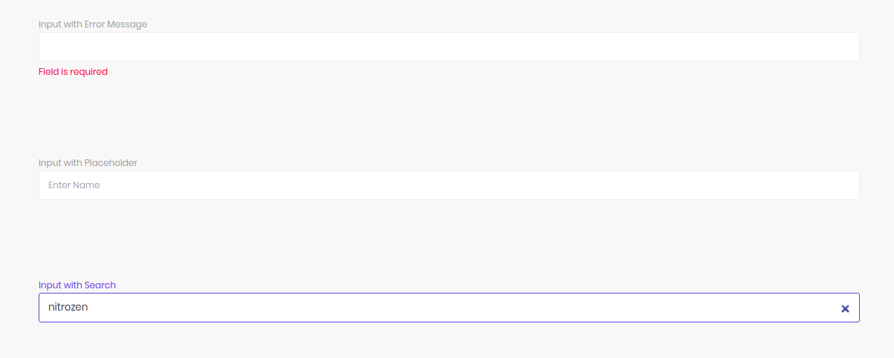<br>
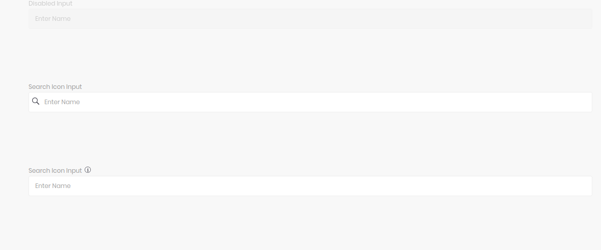<br>
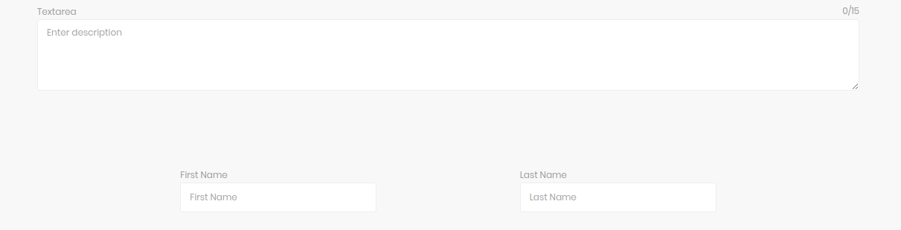<br><br><br><br><hr>
​
### Nitrozen Menu
​
```
name: "nitrozen-menu",
directives: clickOutside
methods: 
        closeMenu()
​
```
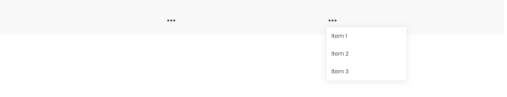<br><br><br><br><hr>
​

### Nitrozen Pagination

```
name: 'nitrozen-pagination'
props:
    name: String
    pageSizeOptions: String or Number
    value: v-model (PaginationConfig)

    PaginationConfig : {
         limit: Number,
         total: Number,
         current: Number
      }
```

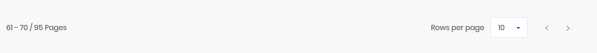<br><br><br><br><hr>

​​
### Nitrozen Radio
​
```
name: 'nitrozen-radio'
props:
    disabled: Boolean
    radioValue: String or Number
    name: String
    value: v-model
​
```
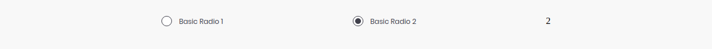<br><br><br><br><hr>
​
### Nitrozen Stepper
​
```
name: 'nitrozen-stepper'
props:
    activeIndex: Number
    maxActiveIndex: Number
    elements: Array
​
```
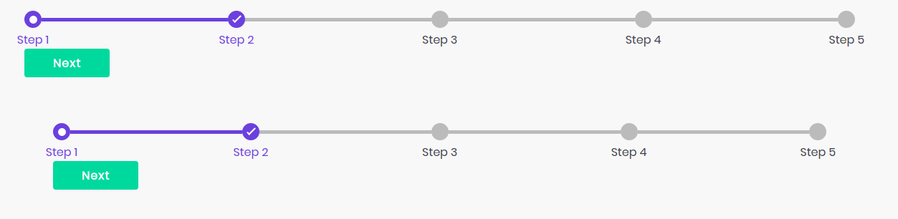<br><br><br><br><hr>
​
### Nitrozen Toggle Button
​
```
name: 'nitrozen-toggle-btn'
props:
    v-model: Boolean
​
```
​
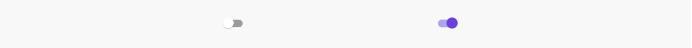<br><br><br><br><hr>
​
### Nitrozen Tooltip
​
```
name: 'nitrozen-tooltip`
props:
    position:
        1. bottom
        2. top
        3. right
        4. left
    tooltipText: String
```